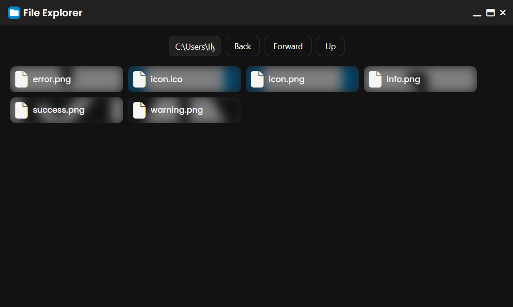

# Flash Explorer - ElectronJS



## Description

Flash Explorer is a desktop application developed with ElectronJS that emulates the functionalities of the Windows Flash Explorer. The graphical interface is designed using HTML and CSS, with icons provided by FontAwesome. The application allows for file system navigation, as well as basic file operations such as copy, paste, and delete, using `robocopy` commands to enhance the speed of these operations.

## Features

- **File and Folder Navigation**: Browse the file system intuitively and visually.
- **Basic File Operations**:
  - **Copy**: Copy files and folders.
  - **Paste**: Paste files and folders into the current directory.
  - **Delete**: Delete files and folders.
- **Modern User Interface**: Designed with a clean and modern look.
- **Icons**: Utilizes FontAwesome icons to represent files and folders.
- **Breadcrumbs**: Quick navigation through the directory structure.

## Installation

### Prerequisites

- Node.js (v14 or higher)
- npm (v6 or higher)

### Clone the Repository

```sh
git clone https://github.com/1ly4s0/flashexplorer.git
cd flashexplorer
```

### Install Dependencies

```sh
npm install
```

### Run the Application

```sh
npm start
```

## Project Structure

```
flashexplorer/
├── assets/              # Images and other assets
├── src/
│   ├── index.html       # Main HTML page
│   ├── renderer.js      # Renderer logic
│   ├── preload.js       # Preload script
|   ├── funcs
|   |   ├── alert.js     # Alert functions
|   ├── styles
|   |   ├── styles.css     # Main CSS file
├── main.js              # Main Electron script
├── renderer.js          # Renderer logic
├── LICENSE              # License information
├── package.json         # npm configuration file
└── README.md            # Project description
```

## Usage

1. **Navigation**: Double-click on folders to open them.
2. **File Operations**: Right-click on a file or folder to open the context menu with options to copy, paste, and delete.
3. **Breadcrumbs**: Click on the breadcrumbs at the top to quickly navigate to different directory levels.

## npm Scripts

- `npm start`: Start the application.

## Contributions

Contributions are welcome! If you have any suggestions or find any issues, please open an issue or submit a pull request.

## License

This project is licensed under the [MIT License](./LICENSE).

---

**Developed by [1ly4s0](https://github.com/1ly4s0)**

---

Thank you for using Flash Explorer! 🚀

---

If you find this project useful, don't forget to star it ⭐ on GitHub.
